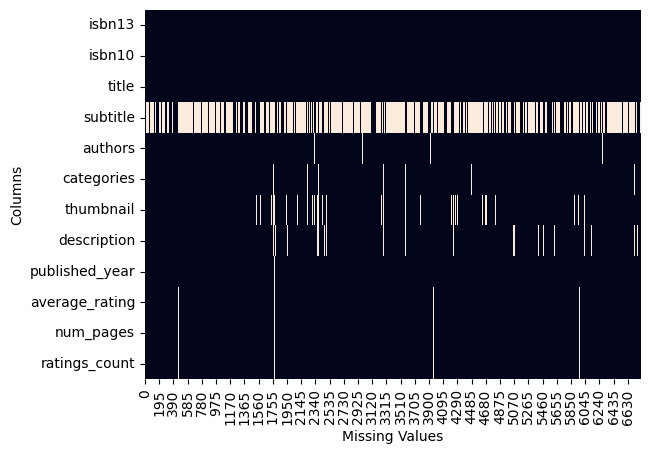
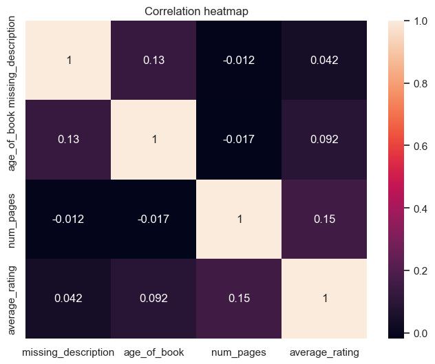
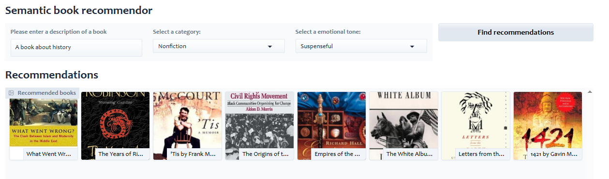
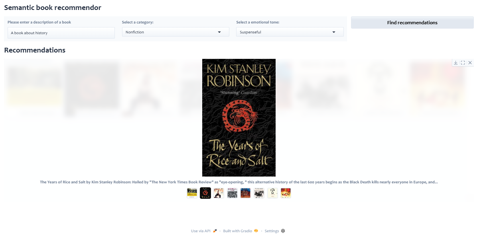

# Semantic Book Recommender System

A machine-learning-based book recommendation system that leverages natural language processing techniques such as vector search, sentiment analysis, and zero-shot classification to provide personalized book recommendations.

## Features

- **Data Exploration**: Cleans and processes a dataset of 7,000 books, handling missing values and optimizing book descriptions.
- **Vector Search**: Uses text embedding and similarity search to recommend books.
- **Sentiment Analysis**: Classifies books based on emotional tones for better recommendations.
- **Gradio Dashboard**: A user-friendly interface for book recommendations based on queries, categories, and emotional tone.

---

## 1. Data Exploration

- **Dataset**: A collection of 7,000 books from Kaggle.
- **Handling Missing Values**:
  - Generated a heatmap to visualize missing data.
  
  - Checked correlations between `average_ratings`, `num_pages`, and `ratings_count` with `description` using Spearman correlation (values were binary: present or missing).
  - Correlation was not strong enough for further consideration.
  
- **Data Cleaning & Preparation**:
  - Filtered books with sufficiently long descriptions.
  - Appended `ISBN` to descriptions for identification.
  - Processed missing subtitles by combining them with titles (`Title: Subtitle`) or using the title alone if the subtitle was missing.

---

## 2. Vector Search

- **Text Splitting**:
  - Created a single file containing book descriptions and `ISBN`.
  - Split descriptions into smaller chunks for processing.
- **Embedding & Storage**:
  - Generated text embeddings.
  - Stored embeddings in ChromaDB for efficient search and retrieval.
- **Recommendation Engine**:
  - Developed a function to retrieve `ISBNs` of the 50 most similar books based on a given query.
- **Category Reduction**:
  - Mapped books into four broad categories:
    - Fiction
    - Nonfiction
    - Children's Fiction
    - Children's Nonfiction
- **Filling Missing Categories**:
  - Applied zero-shot classification to predict missing categories using book descriptions.
  - Assigned the highest-confidence label to the book.

---

## 3. Sentiment Analysis

- **Emotional Classification**:
  - Analyzed book descriptions to classify them into the following emotional tones:
    - Anger
    - Disgust
    - Fear
    - Joy
    - Sadness
    - Surprise
    - Neutral
- **Sentence-Level Analysis**:
  - Performed sentiment analysis on individual sentences.
  - Aggregated the highest score across sentences to determine the dominant tone for each book.

---

## 4. Gradio Dashboard

- **User Interface**:
  - A web-based application built using [Gradio](https://gradio.app/).
  - Allows users to input a query, select a category, and filter recommendations based on emotional tone.
- **Features**:
  - Search for books using keywords.
  - Filter results by category and sentiment.
  - Get personalized recommendations based on book descriptions and user preferences.
  
  

---

## Installation & Usage

### Prerequisites
Ensure you have the following installed:
- Python 3.8+
- `pip` package manager
- Required dependencies (install using the steps below)

### Installation

1. Clone the repository:
   ```bash
   git clone https://github.com/aniqjaved01/book_recommender.git
   cd book_recommender
   ```

2. Install dependencies:
   ```bash
   pip install -r requirements.txt
   ```

3. Run the Gradio dashboard:
   ```bash
   python app.py
   ```

4. Open the local web interface (Gradio will provide a link in the terminal).

---

## Technologies Used

- **Data Processing**: Pandas, NumPy
- **Vector Search & Embeddings**: ChromaDB, Sentence Transformers
- **Sentiment Analysis**: Transformers, Zero-Shot Classification
- **Web UI**: Gradio

---

## Contributing

Contributions are welcome! Feel free to fork the repo and submit pull requests.

---

## License

This project is licensed under the MIT License. See `LICENSE` for details.

---

## Contact

For any questions or suggestions, feel free to reach out via GitHub issues.

Happy Reading! 📚✨

